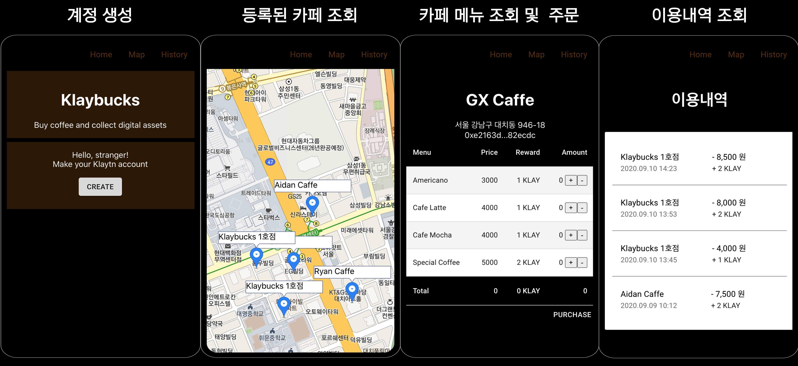

# 주의
이 저장소는 관리되고 있지 않습니다. 
일부 기능은 사용하는 API의 업데이트를 적용하지 않아 outdate되거나 disable되어있습니다.

# 개요

기술이 발전하면서 이제는 카페에 가지 않아도 집에서 커피를 주문하는 시대가 되었습니다. 하지만, 스마트폰과 웹 기반의 이러한 주문 방식은 주문 처리 시스템과 데이터베이스 운용이 필요하며 이를 구축, 운용하는 데에는 상당한 개발 인력과 비용이 듭니다. 따라서 이러한 온라인 커피 주문 시스템은 그 편리함에도 불구하고 충분한 자본과 인력을 갖춘 일부 대형 커피 전문점만이 운영합니다. 그런데 만약, 고성능 퍼블릭 블록체인으로 이러한 주문 시스템을 대체할 수 있다면 상황은 어떻게 달라질까요? 영세한 카페를 포함해 누구나 온라인 커피 주문 시스템을 소비자에게 서비스할 수 있을 것입니다.

여기에서는, 클레이튼 블록체인과 KAS를 활용해 커피 주문을 온라인으로 받고 또 온라인 주문 고객에게 인센티브로 KLAY를 제공할 수도 있는 주문 시스템을 만드는 방법을 안내합니다. 주문 내역은 클레이튼 블록체인에 저장되며 주문에 대한 보상으로 KLAY, NFT, NT 등을 자동으로 전달할 수 있습니다.

카페 원격 주문 시스템은 아래와 같이 3가지 Application으로 구성됩니다.

1. customer-front: 카페 이용자가 사용하는 모바일 웹앱이며 커피를 주문할 수 있습니다.
2. store-front: 카페 주인들이 사용하면 모바일 웹앱이며 가게 위치 등록, 메뉴 등록, 보상 정책 등록 등을 할 수 있습니다.
3. service-backend: 카페 원격 주문 플랫폼의 서비스 주체가 운영하는 서버이며 customer-front와 store-front 사용자들의 요청을 전달받아 블록체인으로 중개하는 역할을 수행합니다. KAS API를 사용하는 주체입니다.

이 문서 혹은 KAS에 관한 문의는 [개발자 포럼](https://forum.klaytn.com/c/kas/kasko/26)을 방문해 도움을 받으십시오.

# 시작하기

카페 원격 주문 시스템을 구성하는 3가지 Application의 소스코드는 하나의 github repository에서 확인할 수 있습니다.
다음 명령어를 수행하여 소스코드를 다운로드 받으십시오.

```
git clone https://github.com/ground-x/kas-bapp-klaybucks.git
```

## 빌드 및 실행

`kas-bapp-klaybucks` 디렉토리에서 아래 명령어를 통해 각각의 Application을 빌드하고 실행할 수 있습니다.

### customer-front

```
cd customer
npm install
npm start
```

### store-front

```
cd store
npm install
npm start
```

### service-backend

service-backend를 실행하기 위해서는 먼저 설정 파일이 필요합니다.
`backend/config.template.json` 파일을 복사하여 `backend/config.json` 파일을 생성한 후 적절한 설정값을 입력하십시오.

#### config.json의 설정 값

- `authorization`: Basic 인증 방식을 사용하는 [KAS API 인증 키](https://docs.klaytnapi.com/basics/api#basics-api-key)를 입력해 주십시오.
- `kas_account`: KAS Wallet API를 사용해 [생성한 계정 주소](https://refs.klaytnapi.com/ko/wallet/latest#operation/CreateAccount)를 입력해 주십시오.
- `master_contract`: (Optional) 자신만의 Klaybucks Master Contract를 사용하려면 Master Contract의 주소를 입력해 주십시오. Master Contract를 배포하기 위해서는 `backend/storeList.sol` 파일을 사용하면 됩니다.

설정 파일을 작성한 후에는 아래 명령어를 통해 service-backend를 실행하실 수 있습니다.

```
cd backend
go run .
```

## Klaybucks customer-front 주요 화면



이 문서 혹은 KAS에 관한 문의는 [개발자 포럼](https://forum.klaytn.com/c/kas/kasko/26)을 방문해 도움을 받으십시오.
